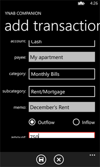

# YNABcompanion #

## Summary ##

YNABcompanion is a Windows Phone 8 app that enables users to track transactions on the go and manually sync them with YNAB over Dropbox.

## Description ##

YNABcompanion allows you to track your transactions on the go. Although this isn't a fully-featured YNAB app for Windows Phone 8, YNABcompanion makes it easy to sync your transaction with YNAB. 

Features include:

 - Add and keep track of transactions and transfers on your phone 
 - Export transactions to Dropbox to be imported into YNAB 
 - Import your budget/register from YNAB using Dropbox to make adding transactions even easier in YNABcompanion 

Features to be included in future versions include:

 - Skydrive support 
 - Filtering transactions by account 
 - Viewing the budget itself 
 - Performance improvement 
 - Saving payees and auto-suggestions for budget 
 - Interactive, optional tutorial 

Users can also remove ads with an in-app purchase. 

YNABcompanion is not officially associated or licensed with YNAB in any way.

## Screenshots ##

   